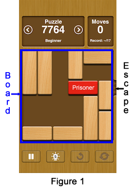
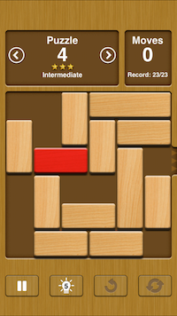
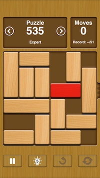
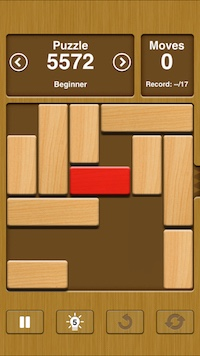
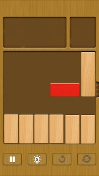

# Guide to _Unblocker_

## Contents

[Installing the app](#installing-the-app)

[The _Unblock Me_ game](#the-unblock-me-game)

[Using the app](#using-the-app)

[How the program works](#how-the-program-works)

* [Domain & UI models](#domain--ui-models)

* [Scanning the image](#scanning-the-image)

* [Solving the puzzle](#solving-the-puzzle)

* [User interface](#user-interface)

[Observations](#observations)

[Future additions](#future-additions)

## Installing the app 

I wrote _Unblocker_ in order to get some experience in Swift programming, and also to discover what resources in time and memory are required to solve the _Unblock Me_ puzzle.  I have posted the code on GitHub because I thought other programmers might find it interesting. I have not submitted the app to the App Store.

In order to install the app:

*  On the [Unblocker home page](https://github.com/cameronpit/Unblocker) click _Clone or download_, then _Download ZIP_.
*  Download the file to an empty folder on your Mac and unZIP it.
*  Open the resulting project in Xcode (version 8 or later).
*  Build and run.

[Contents](#contents)

## The _Unblock Me_ game

[_Unblock Me_](http://itunes.apple.com/us/app/unblock-me/id315021242?mt=8) is a puzzle app by [Kiragames](http://www.kiragames.com/). 
The puzzle consists of a “board” whose size is 6 units by 6 units.  The board can be thought of as being divided into 36 squares or “tiles,” where each tile is 1 unit by 1 unit. On the board are some blocks.  The size of each block, expressed as "width x height",  is either 2x1 or 3x1 or 1x2 or 1x3.  “Horizontal” blocks (2x1 or 3x1) can only move left or right, and “vertical” blocks (1x2 or 1x3) can only move up or down.  A block can never overlap or pass through another block, and must stay completely on the board.

There is one special 2x1 block called the “prisoner” which is colored differently from the other blocks. The object of the puzzle is to move the prisoner to the “escape chute,” which is an opening in the board adjacent to one end of the prisoner’s row. When it reaches the escape chute, the prisoner escapes from the board.

Moving a block constitutes a move.  For example, in the puzzle shown in Figure 1 the 1x3 block in the first column has two possible moves: _down 1 tile_ or _down 2 tiles_. The red block (the "prisoner") has one possible move: _left 1 tile_.  The 1x2 block in the fourth column has no possible moves.

The puzzles in _Unblock Me_ are organized into four categories of difficulty, as determined by the minimum number of moves required to solve.  The categories are:

* Beginner: 15-20 moves
* Intermediate: 21-25 moves
* Advanced: 26-30 moves
* Expert: 31 moves or more

There is also an "Original Free" category, which includes puzzles of several levels of difficulty.

**Note:** On July 7, 2017, Kiragames added a new kind of puzzle under the heading "Daily Puzzle Mode." All the Daily Puzzles so far have been in the Beginner or Intermediate category.  These puzzles add two new features to the game:

*  There are 1x1 blocks which are fixed, i.e., which cannot be moved.
*  The escape chute is not necessarily on the right end of the third row.

_Unblocker_ has been updated to handle the new features correctly.

The puzzles in each category are numbered sequentially starting at 1, so to identify a specific puzzle we give the first letter of the category and the number of the puzzle. For example, the puzzle shown in Figure 1 would be denoted "B-7764."

The game can be played in "Relax Mode" or "Challenge Mode".  The puzzles are the same in both modes; the difference is that Challenge Mode displays the minimum number of moves required to solve the puzzle and the number of moves the player has made.

_Unblock Me_ offers a choice of themes, which determine the appearance of the board and the blocks.  There are six "wood" themes (Original 1, Original 2, Oak Wood, Pine Wood, Cherry Wood, and Maple Wood) and several "special" themes (Christmas, Valentine, etc.)  _Unblocker_ will work with any of the "wood" themes, but not with the others.
 
[Contents](#contents)

## Using the app

The procedure for using _Unblocker_ to solve an _Unblock Me_ puzzle is as follows;

1. In _Unblock Me_ set the theme to one of the "wood" themes, and bring up the puzzle to be solved.  (It doesn't matter whether this is the Relax Mode or the Challenge Mode, although all the examples used in this Guide are displayed in Challenge Mode.)
2. Make a screenshot by pressing the Home button and the Power button simultaneously.
3. In _Unblocker_ tap **New puzzle** and select the last image in the camera roll, which should be the screenshot from step 2.
4. Tap **solve**.
5. Use the buttons to play and stop the solution, single-step forward and back, and reset to the initial step.

The home screen shows some statistics about the solution, and of course there are more at the **Additional stats** tab.  If you cannot recall the number of the puzzle you just solved, the **Original image** tab will show it to you.   

The longest-running puzzle I have found is
Puzzle I-4, with timings as shown below. Note that timings
vary from one run to the next, so these numbers are approximate.

Device    |  Debug     | Release
--------- |  --------: | --------: 
iPad Air  |  17.6 sec  | 1.84 sec
iPhone 6  |  21.5 sec  | 2.53 sec
iPhone SE |   8.5 sec  | 0.93 sec

[Contents](#contents)

## How the program works

The next four sections of this Guide go into the working of the program in some detail. While the code listings could have been truncated or eliminated in order to shorten this document, the convenience of having the code inline — as opposed to having to view the code in a different file — outweighed considerations of brevity. If the reader wants to skip the code, it is easy to scroll past it.

Note:  In this Guide, instances of types are denoted by lowercasing the first letter of the type name.  For example, we may use "blockView" to denote an instance of BlockView without saying so explicitly.

[Contents](#contents)

## [Domain & UI models](Unblocker/Domain%20&%20UI%20models.swift)

#### Block

The Block struct represents a block at its current position.

Every instance of the Block struct has a fixed, unique `id`.
The properties `length`, `isHorizontal`, `isPrisoner`, and `isFixed` are also fixed for a given
instance.  In addition, there are three variable properties:  `col`, `row`, and
`hashValue`.

The column and row define the position of the block in the board, which is
represented by the position of the block's topmost or leftmost end.

The `id` uniquely identifies a particular block regardless of its position.
The property `hashValue` uniquely identifies a particular block at a particular position
on the board.  Thus `hashValue` not only satisfies the definition of "hash
value" (if two blocks-with-position are equal then their hash values are
equal), but also can be used to define equality (if two blocks-with-position
have the same `hashValue` then they are equal, i.e., their corresponding properties are 
all equal).

~~~ swift
struct Block: Hashable {
   static var nextId = 0
   static func ==(lhs: Block, rhs: Block) -> Bool {
      return lhs.hashValue == rhs.hashValue
   }
   let id: Int
   let length: Int
   let isHorizontal: Bool
   let isPrisoner: Bool
   let isFixed: Bool
   var col: Int
   var row: Int
   var hashValue: Int {
      return id << 10 | col << 5 | row
   }
   init(col: Int, row: Int, length: Int, isHorizontal: Bool,
        isPrisoner: Bool, isFixed: Bool) {
      id = Block.nextId
      Block.nextId += 1
      self.col = col
      self.row = row
      self.length = length
      self.isHorizontal = isHorizontal
      self.isPrisoner = isPrisoner
      self.isFixed = isFixed
   }
}
~~~
	

#### BlockView

The BlockView class is a UIView which represents the corresponding block on the screen.

A `blockView` has a transparent background. On it is drawn an opaque
rounded rectangle which is slightly smaller than the bounds of the
view. The background of `boardView` shows through the transparent
edges of the `blockView` outside of the rounded rectangle, creating
a visual border separating adjacent blocks.
	
On the iPad, `tileSize` can change if the device is rotated.
In that case, `boardView` will set the tile size of `blockView`,
and `blockView` will redraw itself at the correct size and position.

~~~ swift
class BlockView: UIView {
   let id: Int   // This is the ID of the corresponding Block
   let color: UIColor
   let width: Int
   let height: Int
   let isFixed: Bool
   var col: Int
   var row: Int

   var tileSize: CGFloat {
      didSet {
         layout()
      }
   }

   func layout() {
      let origin = CGPoint(x: CGFloat(col)*tileSize, y: CGFloat(row)*tileSize)
      let size = CGSize(width: CGFloat(width)*tileSize, height: CGFloat(height)*tileSize)
      frame = CGRect(origin: origin, size: size)
   }

   override func draw(_ rect: CGRect) {
      let gap = tileSize * Const.gapRatio
      let insetRect = rect.insetBy(dx: gap, dy: gap)
      let path = UIBezierPath(roundedRect: insetRect, cornerRadius: 2*gap)
      color.set()
      path.fill()

      func rivet(x: CGFloat, y: CGFloat, radius: CGFloat) {
         // Draws a "rivet head" (filled circle with color Const.rivetColor) 
         // with the point (x, y) as center and with the given radius.
         // The origin is the upper left corner of the visible block, i.e.,
         // of the rectangle insetRect.
         let center = CGPoint(x: insetRect.origin.x+x , y: insetRect.origin.y+y)
         let path = UIBezierPath(arcCenter: center,
                                 radius: radius,
                                 startAngle: 0.0,
                                 endAngle: 2*CGFloat.pi,
                                 clockwise: false)
         Const.rivetColor.set()
         path.fill()
      }

      if isFixed {  // Place rivets near the corners of the block
         let width = insetRect.width
         let height = insetRect.height
         let offset = 2*gap
         rivet(x: offset, y: offset, radius: gap)
         rivet(x: width - offset, y: offset, radius: gap)
         rivet(x: width - offset, y: height - offset, radius: gap)
         rivet(x: offset, y: height - offset, radius: gap)
      }
   }

  init(id: Int, color: UIColor, width: Int, height: Int, col: Int,
        row: Int, tileSize: CGFloat, isFixed: Bool)
   {
      self.id = id
      self.color = color
      self.col = col
      self.row = row
      self.width = width
      self.height = height
      self.isFixed = isFixed
      self.tileSize = tileSize
      super.init(frame: CGRect.zero)
      layout()
      contentMode = .redraw
      isOpaque = false
      backgroundColor = UIColor.clear
   }
   ...
}
~~~

#### Board

Elements of a Set must be Hashable (hence also Equatable, by definition of Hashable).
Note that Block satisfies this requirement, so we can define a `Board` to
be a `Set` of `Block` elements.

~~~ swift	
typealias Board = Set<Block>
~~~

#### Puzzle

The puzzle to be solved is represented by the struct `Puzzle`, which includes the initial configuration of the board and the location of the escape chute.

~~~ swift
enum Side {
   case left
   case right
}

struct Location {
   let side: Side
   let row: Int
}

struct Puzzle {
   let initialBoard: Board
   let escapeSite: Location
}
~~~

#### BoardView and BorderView

`boardView` and `borderView` are instantiated in [Main.storyboard](Unblocker/Base.lproj/Main.storyboard), with `boardView` a subview of `borderView`.

`boardView` is a UIView which represents the playing board on the screen.
Every `blockView` is a subview of the `boardView`. When the dimensions of the board change, each
`blockView` is updated with the new `tileSize`.
	
~~~ swift
class BoardView: UIView {
   override func layoutSubviews() {
      let tileSize = bounds.size.width / CGFloat(Const.cols)
      let blockViews = subviews as! [BlockView]
      for blockView in blockViews {
         blockView.tileSize = tileSize
      }
   }
...
}
~~~

`borderView` provides a border around the `boardView` (which overlays it) and draws the "escape chute" in the correct position.

~~~ swift
class borderView: UIView {
   init() {
      super.init(frame: CGRect.zero)
   }
...
   var puzzle: Puzzle? {
      didSet {
         setNeedsDisplay()
      }
   }
   override func draw(_ rect: CGRect) {
      guard puzzle != nil else {return}
      let tileSize = (frame.width - 2 * Const.borderWidth) / CGFloat(Const.cols)
      let escapeRow = CGFloat(puzzle!.escapeSite.row)
      let escapeWidth: CGFloat = frame.width / 2
      let escapeOriginX: CGFloat

      // Draw escape chute
      switch puzzle!.escapeSite.side {
      case .left:
         escapeOriginX = 0
      case .right:
         escapeOriginX = frame.width - escapeWidth
      }
      let path = UIBezierPath(rect: CGRect(x: escapeOriginX,
                                           y: escapeRow * tileSize + Const.borderWidth ,
                                           width: escapeWidth,
                                           height: tileSize
         )
      )
      Const.escapeColor.set()
      path.fill()
   }
}
~~~

#### Move

In [the Solver class](Unblocker/Solver.swift), the dictionary **`lookupMoveForBoard(:)`** returns 
the move which was applied to the previous board to arrive at the given 
board. The move identifies the block which was moved and the position
of the block in the previous board.

~~~ swift
struct Move {
   let blockID: Int
   let col: Int
   let row: Int
}
~~~

#### SolutionMove

Once a solution has been found, the Solver class will construct an array
of type `[SolutionMove]`. The UnblockerViewController class will use the array
to animate moves in both the forward and backward directions.  For details about the properties of `SolutionMove` see the comment at the end of `func updateSolution()` in [Solver.swift](Unblocker/Solver.swift).
	
~~~ swift
struct SolutionMove {
   let blockID: Int
   let colFwd: Int
   let rowFwd: Int
   let colBack: Int
   let rowBack: Int
}
~~~

[Contents](#contents)

## Scanning the image

The [Scanner class](Unblocker/Scanner.swift) is responsible for converting an image of an _Unblock Me_ puzzle into a representation
of the puzzle within the domain model.
**`UnblockerViewController.newImage()`** invokes an instance of UIImagePickerController to pick
an image from the photo library, and then passes the image to **`scanner.generatePuzzle()`**. Scanner makes use of two structs, `Pixel` and `Pixels`, to represent an image.  These structs were taken almost verbatim from
https://github.com/Swiftor/ImageProcessing.

#### Pixel

A pixel is a 32-bit value which is the concatenation of four 8-bit values representing RGB plus Alpha.

~~~ swift
private struct Pixel {
   var value: UInt32
   var red: UInt8 {
      get { return UInt8(value & 0xFF) }
      set { value = UInt32(newValue) | (value & 0xFFFFFF00) }
   }
   var green: UInt8 {
      get { return UInt8((value >> 8) & 0xFF) }
      set { value = (UInt32(newValue) << 8) | (value & 0xFFFF00FF) }
   }
   var blue: UInt8 {
      get { return UInt8((value >> 16) & 0xFF) }
      set { value = (UInt32(newValue) << 16) | (value & 0xFF00FFFF) }
   }
   var alpha: UInt8 {
      get { return UInt8((value >> 24) & 0xFF) }
      set { value = (UInt32(newValue) << 24) | (value & 0x00FFFFFF) }
   }
}
~~~

#### Pixels

An instance of Pixels is effectively a 2-dimensional array, each element of which is a pixel, representing a UIImage image which is passed in the initializer.

~~~ swift
private struct Pixels {
   var data: UnsafeMutablePointer<Pixel>
   var imgWidth: Int
   var imgHeight: Int
   // (boardOriginX, boardOriginY) will be upper left corner of
   // playing board image.
   var boardOriginX: Int
   var boardOriginY: Int
   init?(image: UIImage) {
      guard let cgImage = image.cgImage else { return nil }
      imgWidth = Int(image.size.width)
      imgHeight = Int(image.size.height)
      boardOriginX = 0
      boardOriginY = 0
      let bitsPerComponent = 8
      let bytesPerPixel = 4
      let bytesPerRow = imgWidth * bytesPerPixel
      data = UnsafeMutablePointer<Pixel>.allocate(capacity: imgWidth * imgHeight)
      let colorSpace = CGColorSpaceCreateDeviceRGB()
      var bitmapInfo: UInt32 = CGBitmapInfo.byteOrder32Big.rawValue
      bitmapInfo |= CGImageAlphaInfo.premultipliedLast.rawValue &
         CGBitmapInfo.alphaInfoMask.rawValue

      guard let imageContext = CGContext(
         data: data,
         width: imgWidth,
         height: imgHeight,
         bitsPerComponent: bitsPerComponent,
         bytesPerRow: bytesPerRow,
         space: colorSpace,
         bitmapInfo: bitmapInfo)
         else { return nil }

      imageContext.draw(cgImage, in: CGRect(
         origin: CGPoint.zero,
         size: image.size
         )
      )
   }
   // pixels[0,0] is upper left corner of playing board image.
   subscript(x: Int, y:Int) -> Pixel {
      get {return data[boardOriginX + x + (boardOriginY + y) * imgWidth]}
      set {data[boardOriginX + x + (boardOriginY + y) * imgWidth] = newValue}
   }
}
~~~

#### findEscape()

Method `findEscape()` in class Scanner locates the escape chute by scanning a given column of pixels in the image, and returns the y-coordinates of the top and bottom of the chute.

~~~ swift
   private func findEscape(inColumn column:Int, forConvertedImage pixels: Pixels) -> (top: Int, bottom: Int)? {
      var y = Const.imageTruncation
      var pixel:Pixel!
      var topOfEscape: Int?
      var bottomOfEscape: Int?
      while y < pixels.imgHeight - Const.imageTruncation {
         pixel = pixels[column, y]
         if pixel.red < Const.startEscapeRedHiThreshold {
            topOfEscape = y
            while pixel.red < Const.endEscapeRedLoThreshold && y <  pixels.imgHeight - Const.imageTruncation {
               y += 1
               pixel = pixels[column, y]
            }
            if y < pixels.imgHeight - Const.imageTruncation {
               bottomOfEscape = y
            }
            break
         }
         y += 1
      }
      if topOfEscape == nil || bottomOfEscape == nil {
         return nil
      } else {
         return (topOfEscape!, bottomOfEscape!)
      }
   }
~~~

#### getBoardImage()

Method `getBoardImage()` in class Scanner determines the position of the playing board and the size of the tiles. First, it calls `findEscape()` twice to locate the escape chute on the left or right side of the image, and sets `tileSize` equal to the height of the escape chute. Method `getBoardImage()` then calls the method `findNextBlackLine()` twice to find the second horizontal black line in the image, which is the top of the board's image within the overall image. The board's origin is on this line, and three tiles to the left of the horizontal center of the image. Note that the method `findNextBlackLine()`, which is in the file [Scanner.swift](Unblocker/Scanner.swift), is not shown here; it is very similar to the method `findEscape()` shown above.

~~~ swift
   private func getBoardImage(fromImage image: UIImage) -> (Pixels, Location)? {
      let optPixels = Pixels(image: image)
      guard var pixels = optPixels else {return nil}
      let leftEscape = findEscape(inColumn: 0, forConvertedImage: pixels)
      let rightEscape = findEscape(inColumn: pixels.imgWidth-1, forConvertedImage: pixels)
      // ^^ is XOR (Exclusive Or) operator defined in "Extensions & generics.swift"
      guard leftEscape == nil ^^ rightEscape == nil else {return nil}
      let escape = leftEscape == nil ? rightEscape : leftEscape
      let topOfEscape = escape!.top
      let bottomOfEscape = escape!.bottom
      tileSize = bottomOfEscape - topOfEscape
      guard tileSize > 4 else {return nil}
      let firstLine = findNextBlackLine(startRow: Const.imageTruncation, forConvertedImage: pixels)
      guard firstLine != nil else {return nil}
      let secondLine = findNextBlackLine(startRow: firstLine!.bottom, forConvertedImage: pixels)
      guard secondLine != nil else {return nil}
      let topOfBoard = secondLine!.top
      let escapeRow = Int(round(Double(topOfEscape - topOfBoard)/Double(tileSize)))
      let escapeSite = leftEscape == nil ? Location(side: .right, row: escapeRow) : Location(side: .left, row: escapeRow)
      let centerX = pixels.imgWidth / 2
      // Set origin to upper left corner of board image
      pixels.boardOriginX = centerX - 3 * tileSize
      pixels.boardOriginY = topOfBoard

      // Consistency check
      guard pixels.boardOriginX > 0
         && pixels.boardOriginX + Const.cols * tileSize < pixels.imgWidth
         && pixels.boardOriginY > 0
         && pixels.boardOriginY + Const.rows * tileSize < pixels.imgHeight
         else {return nil }

     return (pixels, escapeSite)
   }
~~~

#### convertTile()

**`convertTile(:)`** is a method to convert row or col to a coordinate of a pixel at (or near) the center of a tile.

~~~ swift
private func convertTile(_ coordinate: Int) -> Int {
   return coordinate*tileSize + tileSize/2
}
~~~

#### generatePuzzle()

Method `generatePuzzle()` uses the array of pixels returned by `getBoardImage()` and returns an optional `Puzzle?`.  If the presumed initial board does not follow the rules of the game, the method returns nil.

In `generatePuzzle()` and `getBoardImage()`, the values used to test colors of pixels were determined by experiment, using the cherry wood theme.  Serendipitously the same values work for all the "wood" themes.

~~~ swift
   func generatePuzzle(fromImage image:UIImage) -> Puzzle? {
      guard let (pixels, escapeSite)  = getBoardImage(fromImage: image) else {return nil}
      var board = Board()
      wasVisited.reset()
      Block.nextId = 0

      // MARK: Main loop for func generatePuzzle
      for row in 0..<Const.rows {
         for col in 0..<Const.cols {

            // If tile is empty, mark as visited
            if pixels[convertTile(col),convertTile(row)].red < Const.emptyRedHiThreshold {
               wasVisited[col, row] = true
            }

            // If tile was previously visited, skip to next col.
            if wasVisited[col,row] {continue}

            // Note that findBlockWidth() and findBlockHeight() both set
            // wasVisited[]
            let blockWidth = findBlockWidth(col: col, row: row, pixels: pixels)
            let blockHeight = findBlockHeight(col: col, row: row, pixels: pixels)
            guard blockWidth==1 || blockHeight==1 else {return nil}
            let block = Block(
               col: col,
               row: row,
               length: max(blockWidth, blockHeight),
               isHorizontal: blockWidth > 1,
               isPrisoner: pixels[convertTile(col),convertTile(row)].green <
                  Const.redBlockGreenHiThreshold,
               isFixed: blockWidth == 1 && blockHeight == 1
            )
            board.insert(block)
         }
      }

      // There must be exactly 1 prisoner, and it must be a horizontal block of 
      // length 2 in the escape row.
      // Otherwise return nil.
      let prisoners = board.filter({$0.isPrisoner})
      if prisoners.count == 1 {
         let prisoner = prisoners.first!
         if prisoner.isHorizontal && prisoner.length == 2 && prisoner.row == escapeSite.row {
            return Puzzle(initialBoard: board, escapeSite: escapeSite)
         }
      }
      return nil
   }
~~~

#### findBlockwidth() and findBlockheight()

`findBlockwidth(col: row: pixels:)` returns the width of the block at [col, row] and sets `wasVisited = true` for every tile in row number `row` which is covered by the block.  The code for 
`findBlockheight(col: row: pixels:)` is similar but returns the height of the block.

~~~ swift
   private func findBlockWidth(col:Int, row:Int, pixels: Pixels) -> Int {
      var width = 1
      let y = convertTile(row)
      var c = col
      while true {
         wasVisited[c,row] = true
         // If we are in the last column, stop here
         if c == Const.cols - 1 {
            return width
         }
         // Otherwise keep going:
         // Check if there is an edge between this tile
         // and the next.
         for x in convertTile(c)..<convertTile(c+1) {
            if pixels[x,y].red < Const.edgeRedHiThreshold {
               // Found right edge of block, so return width
               return width
            }
         }
         // Did not find right edge of block, so increment width
         width += 1
         // Next column
         c += 1
      }
   }
~~~

[Contents](#contents)

## Solving the puzzle

The [Solver class](Unblocker/Solver.swift) is responsible for finding a solution. **`solve(puzzle:)`** takes an argument of type `Puzzle` and returns a result of optional type `Solution?`.

#### Struct Solution

~~~ swift
struct Solution {
   var timeInterval: TimeInterval = 0.0
   var numMoves = 0
   var initialBoard: Board = []
   var winningBoard: Board = []
   var numBoardsExamined: Int = 0
   var numBoardsEnqueued: Int = 0
   var finalQSize: Int = 0
   var maxQSize: Int = 0
   var numBoardsExaminedAtLevel: [Int] = []
   var numBoardsEnqueuedAtLevel: [Int] = []
   var boardAtLevel: [Board] = []
   var moves: [SolutionMove] = []
   var isUnsolvable = false
}
~~~  

#### Solution algorithm

We define a "level" of a board as the number of moves taken to reach that board, starting from the initial board. As we shall see in a moment, in _Unblocker_ the level is in fact _the minimum_ number of moves required to reach the given board from the initial board, so it makes sense to talk about _the_ level of a board.

We will need two constructs to hold data, a queue **`q = Queue<(board: Board, level: Int)>()`**, where the generic type `Queue` is defined in the file [Extensions & generics.swift](Unblocker/Extensions%20&%20generics.swift), and a dictionary **`lookupMoveForBoard: [Board : Move]`**.    For a given board, `lookupMoveForBoard[board]` returns the move which
was applied to the previous board to arrive at the given board.  The move identifies the block which was moved and its position in the previous board.

The puzzle is solved with a [breadth-first search](https://en.wikipedia.org/wiki/Breadth-first_search). Each node of q is a tuple consisting of a board and a level.
To start with, q has just one entry, initialBoard at level 0. As the solution progresses, boards and their levels are removed from the top of q, and other boards and their levels are added to the bottom of q. Since the added boards are in non-decreasing order of level, every possible board at level n is dequeued and examined before any board at level n+1.  Therefore a solution, if it exists, will eventually be found (provided there is enough time and memory available), and there will be no solution at any lower level.  In fact, _every_ board in q is inserted into q at the lowest possible level for that board.

Here is the procedure in more detail.  

* Starting with an empty queue, enqueue (initialBoard, 0)
* While queue is not empty and no solution has been found
    * Dequeue (currentBoard, currentLevel)
    * For every newBoard which can be derived from currentBoard by moving one block
        * If newBoard is in dictionary it was found at a lower level, so skip to next newBoard
        * Otherwise calculate move from currentBoard to newBoard
        * Add [newBoard : move] to dictionary
        * Enqueue (newBoard, currentLevel+1)
        * If newBoard has prisoner adjacent to escape chute then newBoard is a winner; mark solution solved and break out of both loops
* If q is empty and no solution has been found, mark solution unsolvable 
* Return solution

#### solve()

Because it may take a significant amount of time to run, `solve()` runs in a GCD queue which is not the main queue, i.e., it runs in a separate thread. In order to terminate `solve()` while it is running, UnblockerViewController sets `abortingSolve = true`.

~~~ swift
   func solve(puzzle aPuzzle: Puzzle) -> Solution? {
      puzzle = aPuzzle
      initialBoard = puzzle.initialBoard
      if initialBoard.isEmpty {return nil}
      if abortingSolve {return nil}
      solution = Solution()
      solution.initialBoard = initialBoard
      switch puzzle.escapeSite.side {
      case .left:
         winColumn = 0
         offstageColumn = -3
      case .right:
         winColumn = 4
         offstageColumn = 7
      }
      startTime = Date()
      solution.numBoardsEnqueuedAtLevel.append(1)
      solution.numBoardsExaminedAtLevel.append(1)
      var allDone = false
      lookupMoveForBoard = [:]
      // Set blockID to -1 as sentinel
      lookupMoveForBoard[initialBoard] = Move(blockID: -1, col:0, row:0)
      q.clearQueue()
      q.enQueue((initialBoard,0))
      solution.maxQSize = q.size

      // MARK: Outer loop
      while !q.isEmpty && !allDone {
         let node = q.deQueue()!
         let currentBoard = node.board
         currentLevel = node.level
         var isOccupied = Matrix<Bool>(cols: Const.cols, rows: Const.rows, defaultElement: false)

         // Mark occupied tiles
         for block in currentBoard {
            let width = block.isHorizontal ? block.length : 1
            let height = block.isHorizontal ? 1 : block.length
            for col in block.col..<block.col+width {
               for row in block.row..<block.row+height {
                  isOccupied[col, row] = true
               }
            }
         }

         // MARK: Inner loop
         // may be executed tens of thousands of times
         //
         for block in currentBoard where !block.isFixed{
            let length = block.length
            if block.isHorizontal {

               // Check tiles to left of block until encountering an
               // occupied tile or the left edge of the board.

               var col = block.col - 1
               while col >= 0 && !isOccupied[col, block.row] && !allDone {
                  allDone = registerBoard(currentBoard,
                                          block: block,
                                          col: col,
                                          row: block.row,
                                          level: currentLevel+1)
                  col -= 1
               }

               // Check tiles to right of block until encountering an
               // occupied tile or the right edge of the board.

               col = block.col + length
               while col < Const.cols && !isOccupied[col, block.row] && !allDone {
                  allDone = registerBoard(currentBoard,
                                          block: block,
                                          col: col-length+1,
                                          row: block.row,
                                          level: currentLevel+1)
                  col += 1
               }

            } else { // Block is vertical

               // Check tiles above block until encountering an
               // occupied tile or the top edge of the board.

               var row = block.row - 1
               while row >= 0 && !isOccupied[block.col, row] && !allDone {
                  allDone = registerBoard(currentBoard,
                                          block: block,
                                          col: block.col,
                                          row: row,
                                          level: currentLevel+1)
                  row -= 1
               }

               // Check tiles below block until encountering an
               // occupied tile or the bottom edge of the board.

               row = block.row + length
               while row < Const.rows && !isOccupied[block.col, row] && !allDone {
                  allDone = registerBoard(currentBoard,
                                          block: block,
                                          col: block.col,
                                          row: row-length+1,
                                          level: currentLevel+1)
                  row += 1
               }
            }
            if allDone {break}
         }    // for block in currentBoard (Inner loop)
      }    // while !q.isEmpty && !allDone (Outer loop)
      if abortingSolve {
         abortingSolve = false
         return nil
      }
      if q.isEmpty && !allDone {
         updateSolution(forWinningLevel: currentLevel, winningBoard: [], isUnsolvable: true)
      }
      return solution
   }
~~~

#### registerBoard()

The `solve()` method calls **`registerBoard()`**, which moves a given block to a given position in a given board, and if the result has not been seen before adds the board to the dictionary and the queue.

~~~ swift
   private func registerBoard(
      _ board: Board,
      block: Block,
      col:Int,
      row:Int,
      level:Int) -> Bool {

      // Any board is only enqueued once.  When dequeuing
      // there is no need to check whether the board
      // has already been visited.

      // Create new board by moving a block
      if abortingSolve {return true}
      var newBoard = board
      var newBlock = newBoard.remove(block)!
      newBlock.col = col
      newBlock.row = row
      newBoard.insert(newBlock)

      // Bump counter
      if level == solution.numBoardsExaminedAtLevel.count {
         solution.numBoardsExaminedAtLevel.append(0)
      }
      solution.numBoardsExaminedAtLevel[level] += 1

      // If newBoard was already enqueued, ignore it
      if lookupMoveForBoard[newBoard] != nil {return false}

      // Bump other counter
      if level == solution.numBoardsEnqueuedAtLevel.count {
         solution.numBoardsEnqueuedAtLevel.append(0)
      }
      solution.numBoardsEnqueuedAtLevel[level] += 1

      // Compute move from board to newBoard, update dictionary and queue

      let move = Move(blockID: block.id, col: block.col, row: block.row)
      lookupMoveForBoard[newBoard] = move
      q.enQueue((newBoard,level))
      if solution.maxQSize < q.size {solution.maxQSize = q.size}

      // If newBoard is a winning board, wrap it up;
      // otherwise keep on truckin'.
      if newBlock.isPrisoner && newBlock.col == winColumn {
         updateSolution(forWinningLevel: level, winningBoard: newBoard, isUnsolvable: false)
         return true
      } else {
         return false
      }
   }
~~~

#### updateSolution()
 
The **`updateSolution()`** method assigns values to the `solution` entity.

~~~ swift
   private func updateSolution(forWinningLevel level:Int,
                               winningBoard board:Board,
                               isUnsolvable: Bool) {
      solution.numBoardsEnqueued = 0
      solution.numBoardsExamined = 0
      for index in 0...level {
         solution.numBoardsEnqueued += solution.numBoardsEnqueuedAtLevel[index]
         solution.numBoardsExamined += solution.numBoardsExaminedAtLevel[index]
      }
      // Set properties which were not set previously
      solution.winningBoard = board
      solution.numMoves = level
      solution.finalQSize = q.size
      solution.timeInterval = Date().timeIntervalSince(startTime)
      solution.isUnsolvable = isUnsolvable
      if isUnsolvable {return}

      //************************************************************************
      // Change winning board to have prisoner block offstage

      // Get last move
      var board = solution.winningBoard
      let move = lookupMoveForBoard[board]!
      // Delete old winning board from dictionary
      lookupMoveForBoard[board] = nil
      // Get last block moved
      let block = board.first(where: {$0.id == move.blockID})!
      // Last block moved must be prisoner
      assert(block.isPrisoner)
      // Move prisoner "offstage"
      var newBlock = board.remove(block)!
      newBlock.col = offstageColumn
      board.insert(newBlock)
      // Add new winning board to dictionary
      lookupMoveForBoard[board] = move
      solution.winningBoard = board

      //************************************************************************
      // Populate arrays solution.moves and solution.boardAtLevel

      while true { // "infinite" loop will exit when blockID = -1

         // We traverse the solution "backwards", i.e., from the final (winning)
         // board to the initial board.

         // Insert board at beginning of solution.boardAtLevel
         solution.boardAtLevel.insert(board, at: 0)

         //*********************************************************************
         // Compute solutionMove and insert it at beginning of solution.moves

         let move = lookupMoveForBoard[board]!
         if move.blockID == -1 {break} // -1 blockID is sentinel
         // Get the block which moves
         let block = board.first(where: {$0.id == move.blockID})!
         // Remove it from the board
         var newBlock = board.remove(block)!
         // Update its position
         newBlock.col = move.col
         newBlock.row = move.row
         // Put it back in the board, ready for the next pass through the loop
         board.insert(newBlock)

         // Although we can think of 'newBlock' as "the same block as 'block,'
         // but in a different position," they are in fact two distinct
         // elements of 'board,' which is just a set of blocks.  That is why we
         // remove 'block' from the board and put 'newBlock' in.

         // Generate the corresponding 'solutionMove'
         let solutionMove = SolutionMove(
            blockID: block.id,
            colFwd: block.col,
            rowFwd: block.row,
            colBack: newBlock.col,
            rowBack: newBlock.row
         )
         solution.moves.insert(solutionMove, at: 0)
      } // while true

      // moves[n].blockID identifies the sole block whose position in
      // boardAtLevel[n] differs from its position in boardAtLevel[n+1]. That
      // block's coordinates in boardAtLevel[n] are (moves[n].colBack, moves[n].rowBack),
      // and its coordinates in boardAtLevel[n+1] are (moves[n].colFwd, moves[n].rowFwd).

   } // private func updateSolution
~~~

[Contents](#contents)

## User interface

Most of the user interface is in [Main.storyboard](Unblocker/Base.lproj/Main.storyboard) and [UnblockerViewController.swift](Unblocker/UnblockerViewController.swift). Classes BlockView and BoardView are also important pieces of the UI; they are in the file 
[Domain & UI models.swift](Unblocker/Domain%20&%20UI%20models.swift).

#### Tab bar controller

The top-level UI element is a tab bar controller with three tabs:

1. The "Unblocker" tab is the default tab. It invokes UnblockerViewController, which is the primary view controller (over 600 lines of code, including comments). 
2. The "Additional stats" tab invokes TextViewController, which presents statistics about the puzzle solution. The text containing the statistics is provided by UnblockerViewController.
3. The "Original image" tab invokes ImageViewControllelr, which presents an image of the _Unblock Me_ screenshot.  The image is provided by UnblockerViewController.

UnblockerViewController, in its ViewDidLoad() method, assigns itself as delegate for the other two view controllers.

#### [UnblockerViewController.swift](Unblocker/UnblockerViewController.swift)

Enum `ProgramState` represents eight possible (and mutually exclusive) states of the program, and enum `ProgramOperation` represents six operations corresponding to six buttons on the main screen.

~~~ swift
private enum ProgramState {
   case boardEmpty
   case notSolved
   case solutionInProgress
   case solutionPlaying
   case atFirstStep
   case atLastStep
   case atOtherStep
   case noSolutionExists
}

private enum ProgramOperation {
   case solve
   case playAll
   case reset
   case stepForward
   case stepBack
   case newImage
}
~~~

The function

~~~ swift
isOperation(_ operation: ProgramOperation, ValidForState state: ProgramState) -> Bool
~~~ 

returns `true` if `operation` is a valid operation when the program is in the state `state`, and returns `false` otherwise.
 
#### UnblockerViewController class

The remainder of this User Interface section describes methods in the UnblockerViewController class. Some, but not all, of the code is shown here.  All of the code is in [UnblockerViewController.swift](Unblocker/UnblockerViewController.swift).

**A note on terminolgy:** As used in _Unblocker_, the terms _level_, _step_, and _move number_ are synonyms.  The usage of these terms is somewhat inconsistent, but in general depends on the context. 

The label `messageLabel` overlays the board display with an information or error message when appropriate.

Methods to manage program state:

~~~ swift
   private var state: ProgramState = .boardEmpty {
      didSet {
         borderView.puzzle = state == .boardEmpty ? nil : puzzle
         setButtons(ForState: state)
         setMessageLabel(ForState: state)
      }
   }

   private func setButtons(ForState state: ProgramState) {
      if state == .solutionInProgress {
         solveButton.isHidden = true
         spinner.startAnimating()
      } else {
         spinner.stopAnimating()
         solveButton.isHidden = false
      }
      if state == .solutionPlaying {
         playAllButton.setTitle("Stop", for: UIControlState())
      } else {
         playAllButton.setTitle("Play", for: UIControlState())
      }
      solveButton.isEnabled = isOperation(.solve, ValidForState: state)
      playAllButton.isEnabled = isOperation(.playAll, ValidForState: state)
      resetButton.isEnabled = isOperation(.reset, ValidForState: state)
      stepForwardButton.isEnabled = isOperation(.stepForward, ValidForState: state)
      stepBackButton.isEnabled = isOperation(.stepBack, ValidForState: state)
      newImageButton.isEnabled = isOperation(.newImage, ValidForState: state)
   }

   private func setMessageLabel(ForState state: ProgramState) {
      messageLabel.backgroundColor = Const.emptyBackgroundColor
      if originalImage == nil {
         messageLabel.textColor = Const.normalMessageLabelColor
         messageLabel.text = noImageMessage
      } else if state == .boardEmpty {
         messageLabel.textColor = Const.urgentMessageLabelColor
         messageLabel.text = invalidImageMessage
      } else if state == .noSolutionExists {
         let fullMessage = "\n    \(noSolutionExistsMessage)    \n"
            + "    Halted at level \(solution.numMoves).\n"
         messageLabel.textColor = Const.urgentMessageLabelColor
         messageLabel.text = fullMessage
      } else {
         messageLabel.text = nil
      }
   }
~~~

Method `newImage()` presents `UIImagePickerController()` to allow the user to select an image from the Photos Library. The returned image is converted, if possible, by the Scanner class into a `Puzzle` sutiable for solution by the Solver class; if the image cannot be so converted, an error message is displayed.

Method `solve()` dispatches a serial GCD queue to invoke the `solve()` method of the Solver class.

Instance variables `imageToShow` and `textToShow`, and method `statsText()`, provide data to the other view controllers referenced by the tab bar controller.

#### Displaying boards

A valid solution consists of a sequence of boards and a sequence of moves, with both sequences indexed by the instance variable `step`. 

The boards are elements of the array `solution.boardAtLevel`, with `solution.boardAtLevel[step]` being equal to the initial board when `step == 0` and to the winning board when `step == solution.numMoves`

The moves are elements of the array `solution.moves`, with `solution.moves[step]` being the move which takes `solution.boardAtLevel[step]` to `solution.boardAtLevel[step+1]`.

The four buttons in the UI which control the display of the solution are **Step forward**, **Step back**, **Play**, and **Reset**. When a solution is playing, the **Play** button becomes the **Stop** button.

Note that the `stopPlaying()` and `resetBoard()` methods can interrupt a running animation. Both methods call `displayBoardAtStep(_:)`, which clears the board view (thereby stoping the animation, since all the animated blocks are deleted) and then re-displays the board at `step`. The class UIViewPropertyAnimator, which was introduced in iOS 10, has the ability to cancel a running animation, but _Unblocker_ was originally written for iOS 9. At any rate, using UIViewPropertyAnimator would not result in code any simpler than that used here.

Method `stepForward()` animates the transition from the current step to the next step, and Method `stepBack()` animates the transition from the current step to the previous step.

~~~ swift
   @IBAction func stepForward() {
      guard isOperation(.stepForward, ValidForState: state) else {return}
      assert (step < solution.moves.count)
      moveBlock(index: step,
                duration: Const.blockViewAnimationDuration,
                delay: 0.0,
                isBack: false)
      step += 1
      if step == solution.moves.count {
         state = .atLastStep
      } else {
         state = .atOtherStep
      }
   }

   @IBAction func stepBack() {
      guard isOperation(.stepBack, ValidForState: state) else {return}
      step -= 1
      moveBlock(index: step,
                duration: Const.blockViewAnimationDuration,
                delay: 0.0,
                isBack: true)
      if step == 0 {
         state = .atFirstStep
      } else {
         state = .atOtherStep
      }
   }
   
   
~~~

Method `playSolution()` animates successive transitions starting with the current step, unless an animation is already playing, in which case it is stopped.

~~~ swift
   @IBAction func playSolution() {
      guard isOperation(.playAll, ValidForState: state) else {return}
      if state == .solutionPlaying {
         stopPlaying()
         return
      }
      state = .solutionPlaying
      setStepLabel(step+1)
      var delay = 0.0
      for index in step..<solution.numMoves {
         moveBlock(index: index,
                   duration: Const.blockViewAnimationDuration,
                   delay: delay,
                   isBack: false)
         delay += Const.blockViewAnimationDelay
      }
   }
~~~

Method `resetBoard()` animates a transition from the currently displayed board to the initial board (step 0) unless a solution is currently in process of being computed, in which case the computation is aborted.

~~~ swift
   @IBAction func resetBoard() {
      guard isOperation(.reset, ValidForState: state) else {return}
      if solution == nil {
         state = .notSolved
         solver.abortingSolve = true
         return
      }
      displayBoardAtStep(step)
      for blockView in boardView.subviews as! [BlockView] {
         // Find block in initial board corresponding to blockView
         let block = solution.initialBoard.first(where: {$0.id == blockView.id})!
         UIView.animate(
            withDuration: Const.boardViewResetAnimationDuration,
            delay: 0.0,
            options: [],
            animations: {
               blockView.col = block.col
               blockView.row = block.row
               blockView.layout() },
            completion: nil
         )
      }
      step = 0
      state = .atFirstStep
   }
~~~

Supporting methods for displaying boards:

~~~ swift
   func moveBlock(index:Int, duration: Double, delay: Double, isBack: Bool) {
      // Note that here move is of type SolutionMove and moves is of type
      // [SolutionMove]
      let moves = solution.moves
      let move = moves[index]
      let col = isBack ? move.colBack : move.colFwd
      let row = isBack ? move.rowBack : move.rowFwd
      // Find the blockView to be moved
      let blockView = (boardView.subviews as! [BlockView])
         .first(where: {$0.id == move.blockID})!
      UIView.animate(
         withDuration: duration,
         delay: delay,
         options: [.curveEaseInOut],
         animations: {
            blockView.col = col
            blockView.row = row
            blockView.layout() },
         completion: {[unowned self] done in
            if done && self.state == .solutionPlaying {
               self.step = index + 1
               if self.step < self.solution.numMoves {
                  self.setStepLabel(self.step + 1)
               }
               if index == self.solution.numMoves - 1 {
                  self.state = .atLastStep
               }
            }
         }
      )
   }

   func stopPlaying() {
      if step < solution.numMoves {
         step += 1
      }
      displayBoardAtStep(step)
   }

   func displayBoardAtStep(_ step: Int) {
      let board = solution.boardAtLevel[step]
      displayBoard(board)
      self.step = step
      switch step {
      case 0:
         state = .atFirstStep
      case solution.moves.count:
         state = .atLastStep
      default:
         state = .atOtherStep
      }
   }

   func displayBoard(_ board: Board){
      clearBoardView()
      numBlocks = board.count
      tiles = 0
      boardView.backgroundColor = Const.boardBackgroundColor
      // displayEscape()
      for block in board {
         tiles += block.length
         let blockColor = block.isPrisoner ? Const.prisonerBlockColor : Const.normalBlockColor
         let width = block.isHorizontal ? block.length : 1
         let height = block.isHorizontal ? 1 : block.length
         let blockView = BlockView(
            id: block.id,
            color: blockColor,
            width: width,
            height: height,
            col: block.col,
            row: block.row,
            tileSize: tileSize,
            isFixed: block.isFixed
         )
         boardView.addSubview(blockView)
      }
   }

   func clearBoard() {
      clearBoardView()
      solution = nil
      initialBoard = []
      state = .boardEmpty
   }

   // If an animation is running, clearBoardView will terminate it, since it
   // deletes all the animated blocks.
   func clearBoardView() {
      for view in boardView.subviews {
         view.removeFromSuperview()
      }
      blocksLabel.text = "--"
      tilesLabel.text = "--"
      boardView.backgroundColor = Const.emptyBackgroundColor
   }
~~~

[Contents](#contents)

## Observations

The solver uses a pure brute force approach, unlike human players, who would be hard put to solve a puzzle if they had to consider thousands of possibilities, as _Unblocker_ does. The human solver uses heuristics which quickly eliminate most of the possibilities. We could try to implement some sort of heuristic in _Unblocker_; I will leave that as an exercise for the reader! (Note that the brute force approach guarantees that the solution which is found is minimal, in the sense that there is no other solution with a smaller number of moves. Any heuristic approach would also have to produce a minimal solution in order to be acceptable.)
   
There does not seem to be much correlation between the number of moves required for a solution with the amount of time the solving takes. To date, the longest solve time has been Puzzle I-4, which has a 23-move solution and requires examining 522,541 boards (40,919 different boards). Puzzle E-535, on the other hand, requires 51 moves, but only 22,622 boards (3,025 different boards) need to be examined. Incidentally, I believe E-535 requires the greatest number of moves of all the puzzles in the Kiragames selection.

 

I used Photoshop Elements to create a couple of unsolvable puzzles, and include them here in case you want to try them out.  (The first one started life as B-5572, but it has been altered.)

 

## Future additions

I have a couple of ideas for extending the program, which I may or may not get around to implementing.

1. Allow the user to edit a board, or create one from scratch.
1. Create a database of puzzles and solutions, which could be used to look for patterns.

[Contents](#contents)

