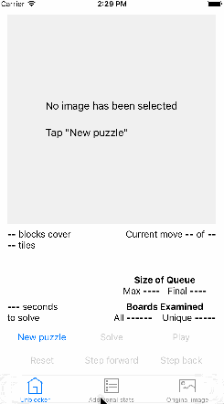

# Unblocker
### Puzzle-solving app programmed in Swift for iOS

_Unblocker_ is an app for the iPhone or iPad which solves any puzzle in _Unblock Me_, an iOS app by [Kiragames](http://www.kiragames.com/), which is [available](http://itunes.apple.com/us/app/unblock-me/id315021242?mt=8) from Apple’s App Store. _Unblocker_ owes a lot to Thanassis Tsiodras' [_UnblockMeSolver_](https://github.com/ttsiodras/UnblockMeSolver), but there are significant differences. 
   
* _Unblocker_ is written in Apple's programming language Swift (version 3) and runs on an iOS device without jailbreaking.  
* The input is a screenshot of a puzzle in Kiragames' _Unblock Me_, of any screen size.
* The solution is presented graphically as an iOS animation.
* _Unblocker_ provides some statistical information about the solution, such as the size of the data structures and the amount of time required. 

There is a detailed discussion of _Unblocker_ in [GUIDE.md](GUIDE.md).

There is a video [here](https://youtu.be/d2Ytntkeed8).

